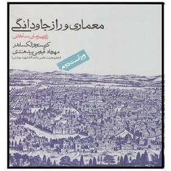

این پلتفرم برای انتشار  یک خوانش جمعی و فصل‌به‌فصل از کتاب _معماری و راز جاودانگی_ است.  
در این پروژه، هر فصل از کتاب توسط یکی از علاقمندان معماری خوانده شده و به‌صورت فایل صوتی منتشر می‌شود.
هدف این کار، تمرین خوانش دقیق متن معماری، تقویت درک مفهومی، و بازآفرینی محتوای نظری در قالب شنیداری است. تفاوت صداها و لحن‌ها بخشی از ماهیت این پروژه  است و نشان‌دهنده‌ی مواجهه‌های متنوع با یک متن واحد می‌باشد .

|   |   |   |
| ------------------------------------------- | ------------------------------------------- | ------------------------------------------- |
|   |  |  |
|  |  |  |
|  |  |  |
|  |  |  |

> [!example] از این‌جا بشنوید
> Contents
